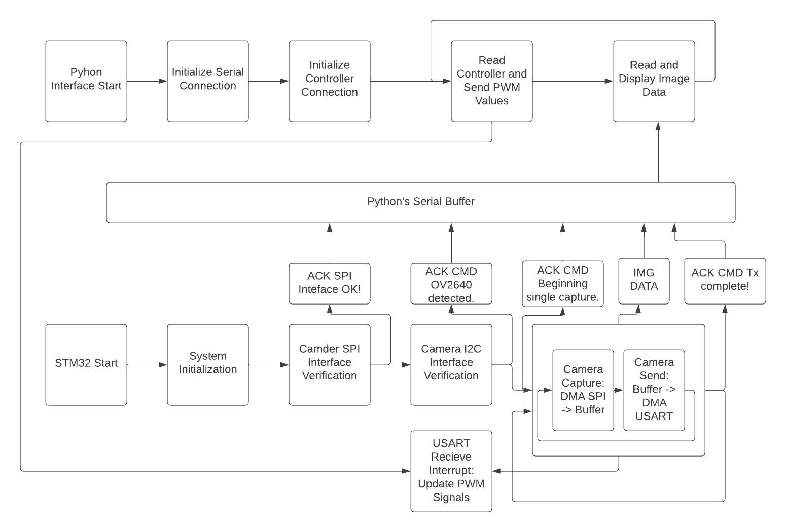
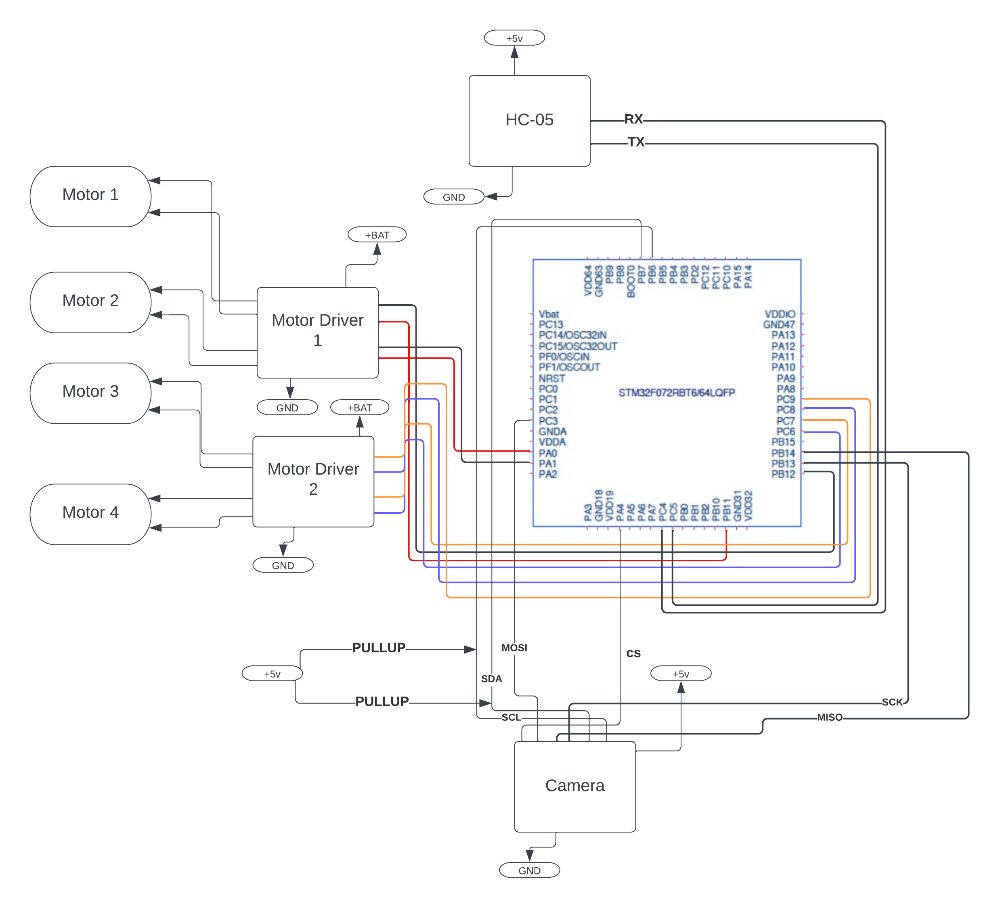

# README - ECE5780 Final Project: Rescue Rover

This readme document serves as a guide for our rescue rover. It includes the following sections:

1. Purpose
2. Functionality
3. Wiring/Schematics
4. Setup
5. Pin Function Table

## 1. Purpose

The purpose of our rover is to manually navigate an obstacle course/maze where the drivers are not able to see the course themselves.

This proposal outlines the project plan for the development of our teams’ final project for Embedded Systems. Our rescue rover will use a camera and send images over the provided USART → Bluetooth → USART connection to the users. The images will be sent as monochrome 160x120-bit images. The users will then use the images to determine which way the robot should move, controlling our omnidirectional rover base. For controlling the rover, an X-box controller will be used to move the robot forward, backward, left, and right respectively. The side-to-side movement is made possible by the omnidirectional wheels. To turn clockwise and counterclockwise, the secondary joystick can be used. 

## 2. Functionality

We’ll be demonstrating UART for communication to the user interface, I2C and SPI for the camera connection, and PWM for motor control from the labs as our three+ techniques. Additional techniques we plan on using include timers, for sampling data from the camera and motor encoders, and interrupts, for handling commands sent to the rover.

FLOW CHART:

## 3. Wiring/Schematics

Wiring Diagram:

## 4. Setup

Here, you will find step-by-step instructions on how to set up the rescue rover. 

1. Ensure all devices are Powered on and wires are connected wherever applicable
    1. Rover
    2. X-box controller
2. Ensure the correct C code is flashed onto the STM32
3. Connect devices to the computer via Bluetooth
    1. Rover 
    2. X-box controller
4. Run the Main Python program on the computer (be sure the correct comport is selected for the HC-05 module on the rover).

## 5. Pin Function Table

# Pin Function Table

| Pin | Function |
| --- | --- |
| PA0 | TIM2_CH1 |
| PA1 | TIM2_CH2 |
| PA2 |  |
| PA3 |  |
| PA4 | SPI_ChipSelect |
| PA5 |  |
| PA6 |  |
| PA7 |  |
| PA8 |  |
| PA9 |  |
| PA10 |  |
| PA11 |  |
| PA12 |  |
| PA13 |  |
| PA14 |  |
| PA15 |  |
| PB0 |  |
| PB1 |  |
| PB2 |  |
| PB3 |  |
| PB4 |  |
| PB5 |  |
| PB6 | I2C_CLK |
| PB7 | I2C_SDA |
| PB8 |  |
| PB9 |  |
| PB10 |  |
| PB11 | TIM2_CH3 |
| PB12 | TIM2_CH4 |
| PB13 | SPI2_CLK |
| PB14 | SPI2_MISO |
| PB15 |  |
| PC0 |  |
| PC1 |  |
| PC2 |  |
| PC3 | SPI2_MOSI |
| PC4 | USART3_TX |
| PC5 | USART3_RX |
| PC6 | TIM3_CH1 |
| PC7 | TIM3_CH2 |
| PC8 | TIM3_CH3 |
| PC9 | TIM3_CH4 |
| PC10 |  |
| PC11 |  |
| PC12 |  |
| PC13 |  |
| PC14 |  |
| PC15 |  |
